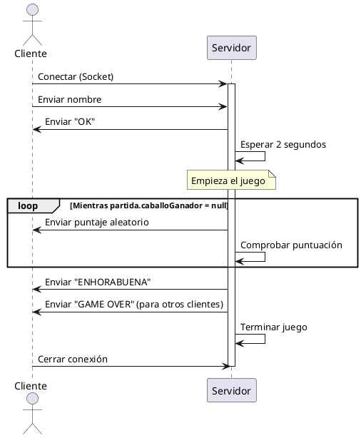
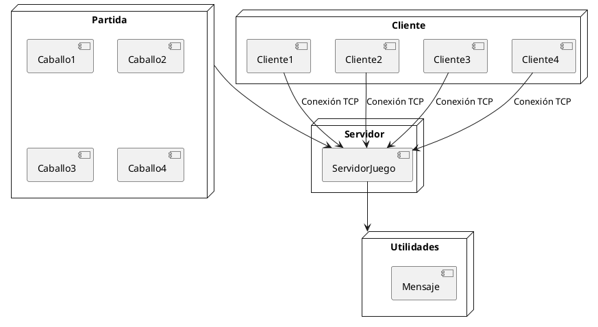
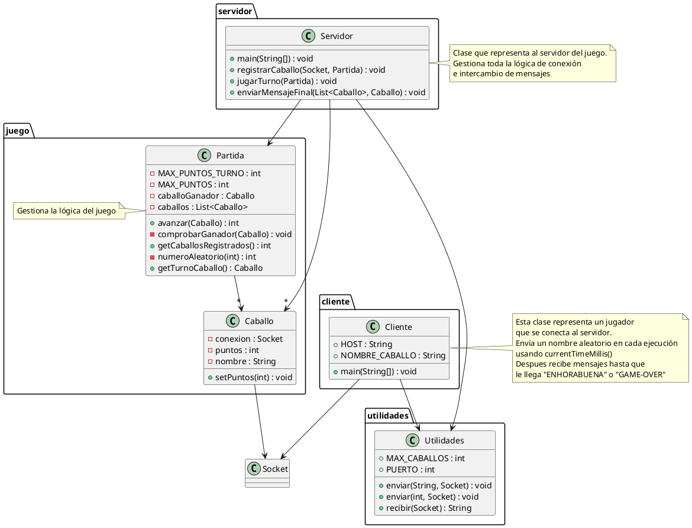

# CARRERA DE CABALLOS

### Protocolo de conexión

```plantuml
@startuml
actor Cliente
participant Servidor

Cliente -> Servidor: Conectar (Socket)
activate Servidor
Cliente -> Servidor: Enviar nombre
Servidor -> Cliente: Enviar "OK"

Servidor -> Servidor: Esperar 2 segundos
note over Servidor: Empieza el juego

loop Mientras partida.caballoGanador = null
    Servidor -> Cliente: Enviar puntaje aleatorio
    Servidor -> Servidor: Comprobar puntuación
end
        Servidor -> Cliente: Enviar "ENHORABUENA"
        Servidor -> Cliente: Enviar "GAME OVER" (para otros clientes)
        Servidor -> Servidor: Terminar juego

Cliente -> Servidor: Cerrar conexión
deactivate Servidor
@enduml

```
### Arquitectura

```plantuml
@startuml

node "Cliente" {
    [Cliente1]
    [Cliente2]
    [Cliente3]
    [Cliente4]
}

node "Servidor" {
    [ServidorJuego]
}
node "Utilidades"{
    [Mensaje]
}
node "Partida"{
    [Caballo1]
    [Caballo2]
    [Caballo3]
    [Caballo4]
}
Cliente1 --> ServidorJuego : Conexión TCP
Cliente2 --> ServidorJuego : Conexión TCP
Cliente3 --> ServidorJuego : Conexión TCP
Cliente4 --> ServidorJuego : Conexión TCP
Partida --> ServidorJuego
ServidorJuego --> Utilidades
@enduml

```
### Diseño

```plantuml
@startuml
package cliente {
    class Cliente {
        +HOST : String
        +NOMBRE_CABALLO : String
        +main(String[]) : void
    }
}
note right of Cliente
    Esta clase representa un jugador 
    que se conecta al servidor.
    Envía un nombre aleatorio en cada ejecución 
    usando currentTimeMillis()
    Despues recibe mensajes hasta que
    le llega "ENHORABUENA" o "GAME-OVER"
end note

package utilidades {
    class Utilidades {
        +MAX_CABALLOS : int
        +PUERTO : int
        +enviar(String, Socket) : void
        +enviar(int, Socket) : void
        +recibir(Socket) : String
    }
}

package servidor {
    class Servidor {
        +main(String[]) : void
        +registrarCaballo(Socket, Partida) : void
        +jugarTurno(Partida) : void
        +enviarMensajeFinal(List<Caballo>, Caballo) : void
    }
}
note right of Servidor
    Clase que representa al servidor del juego.
    Gestiona toda la lógica de conexión
    e intercambio de mensajes
end note

package juego {
    class Partida {
        -MAX_PUNTOS_TURNO : int
        -MAX_PUNTOS : int
        -caballoGanador : Caballo
        -caballos : List<Caballo>
        +avanzar(Caballo) : int
        -comprobarGanador(Caballo) : void
        +getCaballosRegistrados() : int
        -numeroAleatorio(int) : int
        +getTurnoCaballo() : Caballo
    }
    note left of Partida
        Gestiona la lógica del juego
    end note
    
    class Caballo {
        -conexion : Socket
        -puntos : int
        -nombre : String
        +setPuntos(int) : void
    }
}

Servidor --> Partida
Servidor --> Utilidades
Servidor --> "*" Caballo
Partida --> "*" Caballo
Cliente --> Utilidades
Cliente --> Socket
Caballo --> Socket
@enduml
```