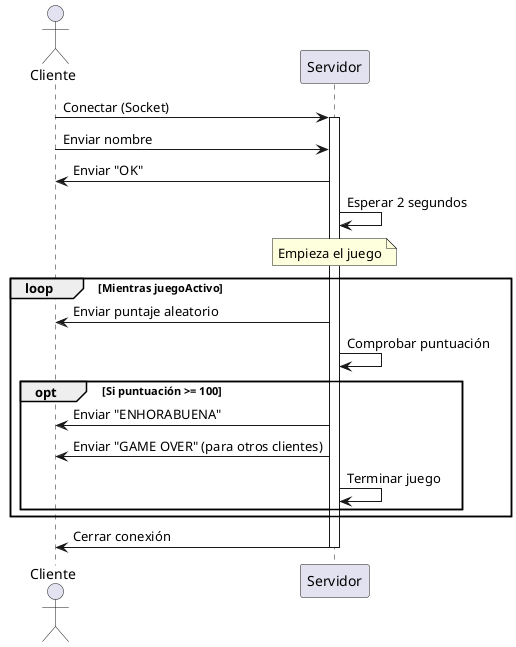
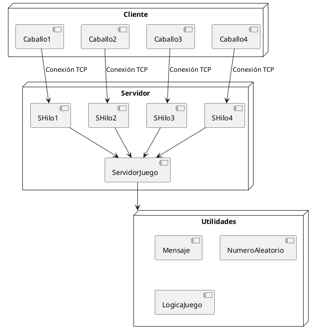
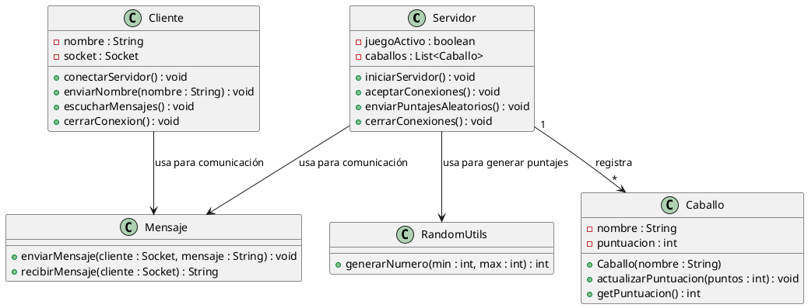

```plantuml
@startuml
actor Cliente
participant Servidor

Cliente -> Servidor: Conectar (Socket)
activate Servidor
Cliente -> Servidor: Enviar nombre
Servidor -> Cliente: Enviar "OK"

Servidor -> Servidor: Esperar 2 segundos
note over Servidor: Empieza el juego

loop Mientras juegoActivo
    Servidor -> Cliente: Enviar puntaje aleatorio
    Servidor -> Servidor: Comprobar puntuación
    opt Si puntuación >= 100
        Servidor -> Cliente: Enviar "ENHORABUENA"
        Servidor -> Cliente: Enviar "GAME OVER" (para otros clientes)
        Servidor -> Servidor: Terminar juego
    end
end

Servidor -> Cliente: Cerrar conexión
deactivate Servidor
@enduml

```

```plantuml
@startuml

node "Cliente" {
    [Caballo1]
    [Caballo2]
    [Caballo3]
    [Caballo4]
}

node "Servidor" {
    [SHilo1]
    [SHilo2]
    [SHilo3]
    [SHilo4]
    [ServidorJuego]
}
node "Utilidades"{
    [Mensaje]
    [NumeroAleatorio]
    [LogicaJuego]
}

Caballo1 --> SHilo1 : Conexión TCP
Caballo2 --> SHilo2 : Conexión TCP
Caballo3 --> SHilo3 : Conexión TCP
Caballo4 --> SHilo4 : Conexión TCP
SHilo1 --> ServidorJuego 
SHilo2 --> ServidorJuego 
SHilo3 --> ServidorJuego 
SHilo4 --> ServidorJuego 
ServidorJuego --> Utilidades
@enduml

```

```plantuml
@startuml
class Servidor {
    - juegoActivo : boolean
    - caballos : List<Caballo>
    + iniciarServidor() : void
    + aceptarConexiones() : void
    + enviarPuntajesAleatorios() : void
    + cerrarConexiones() : void
}

class Caballo {
    - nombre : String
    - puntuacion : int
    + Caballo(nombre : String)
    + actualizarPuntuacion(puntos : int) : void
    + getPuntuacion() : int
}

class Cliente {
    - nombre : String
    - socket : Socket
    + conectarServidor() : void
    + enviarNombre(nombre : String) : void
    + escucharMensajes() : void
    + cerrarConexion() : void
}

class Mensaje {
    + enviarMensaje(cliente : Socket, mensaje : String) : void
    + recibirMensaje(cliente : Socket) : String
}

class RandomUtils {
    + generarNumero(min : int, max : int) : int
}

Servidor "1" --> "*" Caballo : registra
Servidor --> Mensaje : usa para comunicación
Servidor --> RandomUtils : usa para generar puntajes
Cliente --> Mensaje : usa para comunicación
@enduml
```